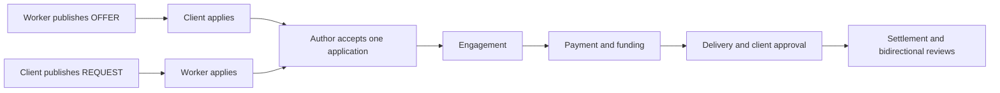
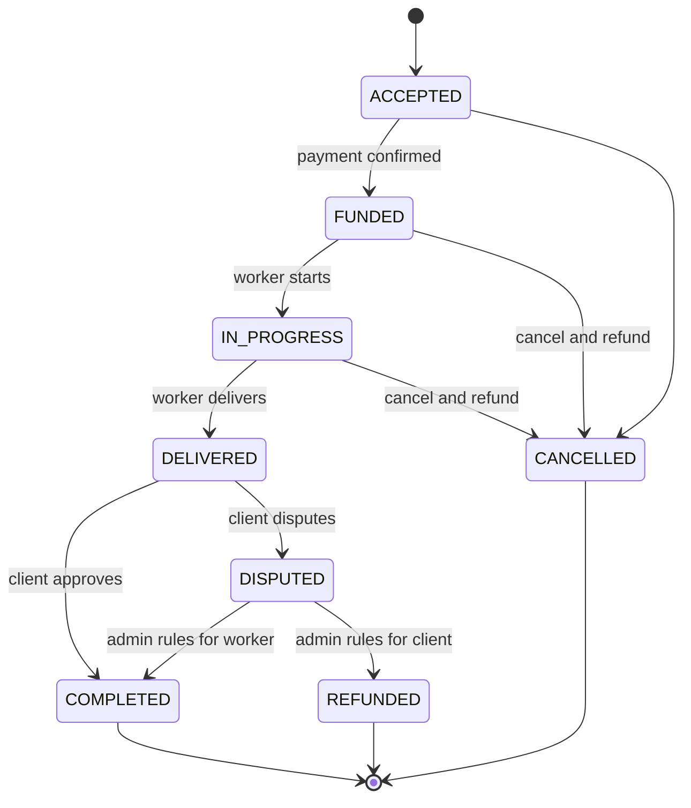

# Service Marketplace Platform

Service Marketplace Platform is a Spring Boot backend for a two-sided marketplace for local and remote services. Clients can publish task requests with budgets and requirements; workers can publish service offers backed by profiles and verified credentials. Both directions converge on the same application, matching, payment, delivery, approval, settlement, and review workflow.

The project focuses on the backend problems that make a marketplace more than CRUD: resource ownership, qualification rules, transactional matching, an escrow-style state machine, private delivery evidence, safe image processing, asynchronous payment confirmation, webhook idempotency, refunds, rating aggregation, audit trails, and stable frontend contracts.

The implemented architecture and design rationale are documented in [`docs/ARCHITECTURE.md`](docs/ARCHITECTURE.md).

## Marketplace model

A `Ticket` is a marketplace listing, not a support ticket:

- `OFFER`: a worker advertises a service and clients apply to purchase it.
- `REQUEST`: a client posts a task and qualified workers apply with proposals.

Tickets may define an optional service window. Application schedules must be in the future and stay inside that window; the accepted proposal becomes the engagement schedule. `expiresAt` is the application deadline. When that deadline or the service-window end passes, the listing disappears from public discovery immediately; a scheduled sweep moves it from `OPEN` to `EXPIRED` and closes pending applications as `EXPIRED` for owner-facing history.



The platform separates administrative role from marketplace capability. A regular `USER` receives both `CLIENT` and `WORKER` capabilities; `ADMIN` remains a privileged system role. A worker profile is created lazily only when a user first publishes an offer or applies to a request.

## Escrow-style lifecycle



Creating or confirming a payment does not release worker funds. A settlement is created only after client approval, or after an administrator resolves a dispute as completed.

Engagement status records the service outcome, while payment and refund records carry the financial outcome. A funded cancellation therefore remains `CANCELLED` after its refund completes; `REFUNDED` is reserved for a dispute resolved in the client's favor.

## Design decisions

| Decision | Rationale |
|---|---|
| One `tickets` table with `kind` | Offers and requests share discovery, category, price, location, and lifecycle fields. Database `CHECK` constraints enforce the fields that differ by direction. |
| Role and capability separation | A marketplace user can buy and sell without maintaining two accounts. Administrative privilege remains explicit and isolated. |
| Credential-based eligibility service | Qualification rules are centralized and applied both when an offer is published and when a worker applies to a regulated request. |
| Transactional application acceptance | A pessimistic ticket lock plus a partial unique index ensures that concurrent requests cannot accept two applications for one ticket. |
| Escrow-style engagement states | Delivery and approval are distinct, so payment, disputes, refunds, and settlements have clear release points. |
| Webhook-confirmed Stripe payments | The synchronous PaymentIntent response is not treated as proof of payment. Only a verified provider event moves an engagement to `FUNDED`. |
| PaymentIntent reuse after failure | A declined confirmation reuses the same intent so late webhooks remain correlated and Stripe retains the complete attempt history; only a terminally canceled intent is replaced. |
| Provider-tracked full refunds | Refund-object events are matched by provider ID and local metadata, then checked for full amount, currency, and payment association before financial state advances. |
| Two layers of idempotency | Local request IDs protect the API; provider idempotency keys and a unique webhook event ledger protect external retries. |
| Mock gateway as the default | Tests and a fresh clone run without network access or secrets while sharing the same gateway contract as Stripe. |
| Pixel re-encoding instead of EXIF tag removal | Every upload is decoded, oriented, resized, and encoded into new bytes. The source file is never retained, so GPS and other metadata cannot leak through a missed tag. |
| Central file registry and ACL | Visibility and ownership live in `stored_files`; one read endpoint applies the same public/private rules to ticket images, delivery evidence, and credential documents. |

Stripe Connect payouts are intentionally out of scope. The current settlement module is an internal ledger; a production marketplace could later add connected worker accounts and transfers behind that boundary.

## Technology

- Java 17 and Spring Boot 3.2
- Spring Security, JWT access tokens, and rotating refresh tokens
- Spring Data JPA and PostgreSQL 16
- Flyway schema evolution from the original booking model
- Stripe PaymentIntents, refunds, signed webhooks, and a deterministic mock gateway
- springdoc-openapi / Swagger UI
- JUnit 5, Mockito, MockMvc, and Testcontainers
- Thumbnailator, metadata-extractor, and TwelveMonkeys ImageIO
- Docker Compose with persistent database and managed-file volumes

## Quick start

Requirements: Docker Desktop or another Docker Engine with Docker Compose 2.24 or newer.

```bash
docker compose up --build
```

No Stripe account or `.env` file is required. Compose starts PostgreSQL and the API with the `dev` profile, loads representative marketplace data and normalized demo photos, and uses the mock payment gateway.

The default stack is deliberately local-only: PostgreSQL and the API bind to `127.0.0.1`, including when the `dev` profile is run directly outside Docker. Inside Compose the API listens on the container network, but its published host port remains loopback-only. The `dev` profile uses a public, development-only JWT signing key and logs a warning at startup. Never expose that profile or key outside a local machine. For a non-development Docker profile, provide a Base64-encoded `JWT_SECRET` that decodes to at least 32 random bytes through the shell or `.env`; the known development fallback is rejected whenever any non-development profile is active.

After startup:

| Resource | URL |
|---|---|
| Swagger UI | http://localhost:8080/swagger-ui/index.html |
| OpenAPI document | http://localhost:8080/v3/api-docs |
| Health check | http://localhost:8080/actuator/health |
| Public ticket board | http://localhost:8080/api/tickets |
| Public categories | http://localhost:8080/api/categories |

Stop the stack with `docker compose down`. Add `-v` only when you intentionally want to remove both the local PostgreSQL and managed-image volumes and rebuild all development data.

If either default host port is already in use, set `MARKETPLACE_DB_HOST_PORT` or `MARKETPLACE_API_HOST_PORT` before running Compose; the container-to-container ports and API configuration do not change.

### Run the API outside Docker

Start only PostgreSQL, activate the `dev` profile, and run Maven:

```bash
docker compose up db -d
SPRING_PROFILES_ACTIVE=dev ./mvnw spring-boot:run
```

On PowerShell:

```powershell
docker compose up db -d
$env:SPRING_PROFILES_ACTIVE = "dev"
.\mvnw.cmd spring-boot:run
```

## Demo accounts

Every development account uses password `Demo1234!`.

| Account | Email | Useful data |
|---|---|---|
| Administrator | `admin@marketplace.com` | Credential review, dispute resolution, settlement batches |
| Marketplace user | `john@example.com` | Client requests, applications, engagements, reviews |
| Marketplace user | `jane@example.com` | Client and worker activity across multiple states |
| Verified worker | `liam@brightwire.example` | Electrical credential and offer |
| Verified worker | `noah@swiftmove.example` | Delivery and moving activity |
| Verified worker | `oliver@techhand.example` | Technical support and completed engagement |

The development seed includes both ticket directions, every pricing mode, all engagement states, pending/verified/rejected credentials, successful/failed/refunded payments, settlements, reviews, and project-owned ticket photos that pass through the real normalization pipeline at startup.

## API contracts

- Money is serialized as a decimal string, for example `"150.00"`, so JavaScript clients do not lose precision.
- Timestamps are ISO-8601 UTC instants.
- Paginated endpoints return `items`, `page`, `size`, `totalElements`, `totalPages`, and `hasNext` inside the standard `ApiResponse.data` field.
- Business failures include a machine-readable error `code`; field errors and structured `details` are included when relevant.
- Ticket summaries embed author, category, and worker summaries to avoid client-side request fan-out.
- Engagement responses embed a nullable refund summary for both participants, so cancelled-work views can show the financial outcome without a separate client-only refund lookup; paginated engagement reads load those summaries in one batch.
- Images are exposed as `{ "thumb": "...", "large": "..." }`; ticket summaries also carry `imageCount`, details carry the ordered gallery, and worker profiles carry a balanced six-item `recentWork` sample.
- Engagement responses carry `deliverableCount`; participants can read ordered private evidence without a client-side join.
- `GET /api/meta/enums` exposes labels, descriptions, and color hints for frontend filters and status badges.
- OpenAPI schemas describe request validation, enums, examples, and decimal-string money fields.

### Main endpoint groups

| Area | Representative endpoints |
|---|---|
| Authentication | `POST /api/auth/register`, `/login`, `/refresh`; `GET /api/auth/me` |
| Discovery | `GET /api/tickets`, `/api/tickets/{id}`, `/api/categories`, `/api/workers/{id}` |
| Ticket authoring | `POST /api/tickets`; `PUT /api/tickets/{id}`; publish and close actions |
| Ticket photos | `POST`/`DELETE /api/tickets/{id}/images`; `PUT /api/tickets/{id}/images/order` |
| Matching | Apply, list, accept, reject, and withdraw under `/api/tickets/*/applications` and `/api/applications/*` |
| Engagements | `GET /api/engagements`; pay, start, deliver, approve, dispute, cancel |
| Delivery evidence | `POST`/`GET`/`DELETE /api/engagements/{id}/deliverables` |
| Credentials | `/api/me/credentials`, private document upload, and `/api/admin/credentials` |
| Managed files | `GET /api/files/{key}` with centralized public/private authorization |
| Reviews | `POST /api/engagements/{id}/reviews`; public worker and client review feeds |
| Finance | `/api/refunds`, `/api/settlements`, and admin settlement batches |
| Provider callbacks | `POST /api/webhooks/stripe` |

Public access is intentionally limited to marketplace discovery, public profiles/reviews, enum metadata, payment configuration, documentation, and health. Nested application endpoints are never made public by the ticket read rules. Resource ownership checks live in services, not only in controllers.

## Managed images and delivery evidence

Uploads accept JPEG, PNG, or WebP input up to 8 MB. The server checks magic bytes rather than trusting the request header, reads dimensions before full decoding, rejects sources over 12,000 pixels on either axis or 40 megapixels, applies EXIF orientation, and re-encodes two variants: a 400-pixel thumbnail and a 1,400-pixel large image. Opaque output is JPEG and transparent output is PNG; the original bytes and metadata are discarded.

Ticket authors may attach at most eight photos while a listing is `DRAFT` or `OPEN`. Draft files are private and become public in the same transaction that publishes the ticket. The first image is cached on the ticket for board reads; details load the full ordered gallery. Public file responses are immutable and cacheable because a managed key never changes content.

Delivery evidence is private. Only the assigned worker can add or remove up to eight images, and only while the engagement is `IN_PROGRESS`; after `deliver`, evidence is immutable so it remains available for approval and dispute review. The client, worker, and administrators may read it. Set `images.require-deliverable-on-deliver=true` to require at least one image before the worker can transition to `DELIVERED` (the local default is `false`).

Credential documents use the same private registry but store one normalized large variant. New API submissions cannot provide arbitrary external URLs; legacy seeded or historical references remain compatible during migration. The owning worker and administrators can read the document.

Local storage is selected with `storage.provider=local`. Set `STORAGE_LOCAL_ROOT` to choose the directory and optionally set `STORAGE_PUBLIC_BASE_URL` when responses require absolute URLs. Docker mounts `/var/marketplace/files` from the `marketplace-file-data` named volume. Detached staging files are inaccessible and are removed after the configured orphan-retention period. S3, presigned URLs, video, HEIC decoding, and CDN delivery are deliberately outside this local backend scope.

Publishing a ticket makes its gallery URLs public, immutable assets. Removing a ticket from discovery does not revoke copies already downloaded or cached from those URLs; authors should remove unwanted images while the ticket is still mutable in `DRAFT` or `OPEN`. A production moderation or legal-erasure workflow would require an explicit asset-revocation policy rather than relying on listing visibility alone.

The included controls are appropriate for the local-only delivery target, not an Internet-facing deployment. Before public deployment, add per-user storage quotas, upload rate limits, abandoned-draft retention, disk-capacity alerts, and abuse monitoring; the per-ticket image cap and unattached-file cleanup do not replace those platform controls.

## Stripe test mode

The mock gateway is enough to exercise the full lifecycle locally. To use Stripe's test environment:

1. Copy `.env.example` to `.env`.
2. Generate and uncomment `JWT_SECRET` (for example, with `openssl rand -base64 32`), then set `PAYMENT_GATEWAY=stripe` and provide `sk_test_*` and `pk_test_*` keys.
3. Forward signed events and copy the printed `whsec_*` secret into `.env`:

   ```bash
   stripe listen --forward-to localhost:8080/api/webhooks/stripe
   ```

4. Restart the API, create a payment, and confirm the returned PaymentIntent with Stripe Elements or the Stripe CLI.

The API refuses `sk_live_*` secret keys. Secrets are read only from the environment; `.env` is ignored by Git. Useful Stripe test cards include `4242 4242 4242 4242` for success, `4000 0000 0000 0002` for a decline, and `4000 0025 0000 3155` for an authentication flow. Use any future expiry date and any CVC in test mode.

Webhook processing verifies `Stripe-Signature` against the exact raw body. Event IDs are inserted with a unique `(provider, event_id)` constraint. Duplicate completed events return success without reapplying state, while an event that arrives before its local payment/refund record returns a retryable server response. A successful PaymentIntent must match the local amount and currency before it can fund an engagement. Refund completion uses `refund.created`, `refund.updated`, and `refund.failed`; provider ID, metadata, amount, currency, and available PaymentIntent/charge associations are validated before local state changes. Because `charge.refunded` reports aggregate Charge-level refunds, including partial or externally initiated refunds, it is acknowledged without changing the marketplace ledger. Stored payloads are recursively stripped of client secrets and secret-like fields.

PaymentIntent client secrets are transient response data: they are never stored in `payments`. An idempotent retry retrieves the intent from the gateway by its provider ID and returns a secret only while client confirmation remains possible; that read does not advance payment or engagement state. Failed confirmations reuse the same PaymentIntent, following Stripe's [PaymentIntent lifecycle](https://docs.stripe.com/payments/paymentintents/lifecycle), so late provider events remain correlated. When a provider-confirmed canceled intent must be replaced, its ID is moved into a superseded-intent ledger in the same transaction as the new ID. Late failures for that old attempt are harmless no-ops; a late success fails closed for reconciliation rather than funding against the wrong attempt.

## Tests

The automated suite always selects the mock gateway and never calls Stripe:

```bash
./mvnw clean test
```

The suite covers validation, capability and ownership rules, ticket discovery, qualification, matching, engagement transitions, image signatures and dimensions, EXIF/GPS stripping, orientation, file path traversal, private-file ACLs, gallery ordering, immutable delivery evidence, credential documents, payment/refund/settlement behavior, review aggregation, signed webhook handling, duplicate events, out-of-order callbacks, schema migrations, and full marketplace flows. Database integration tests run against PostgreSQL through Testcontainers.

## Project layout

```text
src/main/java/com/relix/marketplace/
├── application/   # proposals and transactional matching
├── audit/         # append-only business event history
├── auth/          # JWT and refresh-token lifecycle
├── catalog/       # categories and qualification requirements
├── common/        # API envelopes, pagination, metadata, errors
├── engagement/    # fulfillment state machine and delivery evidence
├── payment/       # gateway abstraction, Stripe, mock, webhooks
├── refund/        # asynchronous refund workflow
├── review/        # bidirectional reviews and rating aggregation
├── settlement/    # worker payout ledger and batches
├── storage/       # normalized media, registry, ACL, and local storage
├── ticket/        # bidirectional listings and image galleries
├── user/          # accounts, roles, and capabilities
└── worker/        # profiles, credentials, and eligibility
```

Flyway migrations `V1`-`V9` preserve the original booking history. Migrations through `V26` evolve that schema into the marketplace model and then add the central file registry, ticket galleries, immutable engagement evidence, and managed credential documents without rewriting migration history.
