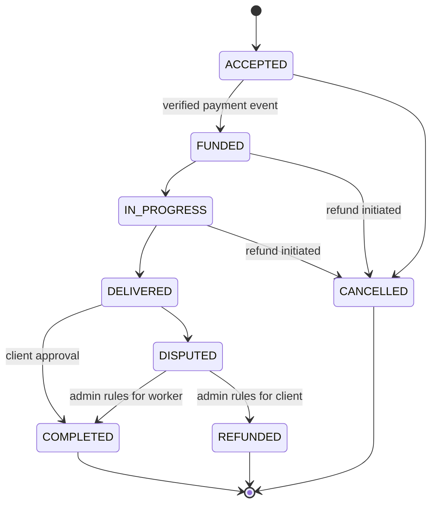

# Service Marketplace Architecture

This document describes the implemented backend architecture and its key design tradeoffs. Executable behavior and Flyway migrations remain authoritative.

## Product model

The platform is a two-sided service marketplace:

- A worker publishes an `OFFER` for a service they can perform.
- A client publishes a `REQUEST` for work they need completed.
- Either direction receives `Application` proposals.
- Accepting one proposal atomically creates an `Engagement` between one client and one worker.

`Ticket` means a marketplace listing in this project, not a customer-support ticket. Offers and requests share one table because their discovery, category, price, location, schedule, and lifecycle fields are mostly identical. Database constraints enforce the direction-specific fields.

## Identity and authorization

Administrative privilege and marketplace behavior are separate concepts:

- `User.role` is `USER` or `ADMIN`.
- A regular user may hold both `CLIENT` and `WORKER` capabilities.
- A worker profile is created lazily when a user first publishes an offer or applies to a request.
- Controllers require authentication for writes; services enforce ticket ownership and engagement participant rules.
- Public access is limited to discovery, public profiles/reviews, metadata, payment configuration, documentation, health, and the signed Stripe webhook.

## Scheduling semantics

Ticket scheduling uses three distinct concepts:

| Field | Meaning |
|---|---|
| `tickets.expires_at` | Application deadline. An expired open listing is immediately hidden from public discovery and rejects new applications. A scheduled sweep materializes `OPEN -> EXPIRED` for history and filtering. |
| `tickets.service_window_start/end` | Optional interval in which the work may occur. Either bound may be open-ended; once the end passes, the listing is no longer actionable even if its explicit application deadline is later. |
| `applications.proposed_start/end` | Applicant's concrete proposed schedule. When a ticket has either service-window bound, a complete proposal interval is required, must stay inside the window, and cannot be shorter than the ticket's estimated duration. |
| `engagements.scheduled_start/end` | Accepted schedule copied from the winning application. This is the fulfillment source of truth. |

The booking-era `time_slots` table represented a separate selectable-calendar model that the marketplace flow never used. Migration V19 first copies any historical slot timestamps into otherwise-empty engagement schedule fields, then removes `engagements.time_slot_id` and the obsolete table. A future calendar-booking product could add availability as a separate bounded context; disconnected slot APIs are intentionally not retained.

Public ticket search supports `serviceFrom` and `serviceTo`. A ticket matches when its service window overlaps the requested interval; open-ended ticket windows remain eligible.

The expiration sweep also transitions pending applications to `EXPIRED`, so applicant workspaces do not retain proposals that can no longer be accepted.

## Matching and concurrency

Application acceptance runs in one transaction:

1. Lock the ticket.
2. Verify that the caller authored it and that it is still open and unexpired.
3. Revalidate price, credentials, and schedule.
4. Accept the selected application and reject other pending applications.
5. Mark the ticket `MATCHED` and create the engagement.

A partial unique database index allowing only one accepted application per ticket is the final concurrency guard.

## Engagement and refund semantics

Engagement status describes the service outcome; payment and refund records describe the financial outcome. Therefore:

- Cancelling a funded engagement leaves it `CANCELLED`, even after its refund completes.
- A dispute resolved for the client transitions `DISPUTED -> REFUNDED` through the engagement state validator.
- `CANCELLED` and `REFUNDED` are terminal and webhook replays are idempotent.
- Settlement is created only after client approval or an admin resolution to `COMPLETED`.

This separation prevents a financial callback from silently rewriting the marketplace outcome and keeps frontend status filters stable.

## Payment boundary

`PaymentGateway` isolates Stripe from marketplace state transitions. The deterministic mock implementation uses the same contract and keeps tests offline.

- Creating a Stripe PaymentIntent records its provider ID and provider status, but the `client_secret` is returned only in the current API response.
- `client_secret` is not stored in the marketplace database, seed data, logs, or webhook payload ledger.
- An idempotent retry for the same pending request retrieves the PaymentIntent by provider ID and returns its current transient secret.
- A failed confirmation reuses that same PaymentIntent, preserving the mapping for late events and allowing Stripe to retain the transaction's complete attempt history. Only a provider-confirmed `canceled` intent may be replaced.
- Replaced PaymentIntent IDs are retained in a superseded ledger. Late failure events are acknowledged without changing the current attempt; late success events fail closed for manual/provider reconciliation.
- Refund-object events are authoritative. A refund completes locally only after its provider ID, full amount, currency, and available PaymentIntent/charge associations match; partial and unrelated refunds cannot release local financial state.
- Retrieval never marks a payment successful or funds an engagement.
- Only a verified, idempotently processed `payment_intent.succeeded` event whose `amount_received` and currency exactly match the local payment transitions an engagement to `FUNDED`.
- Refund completion is asynchronous for Stripe and immediate for the mock gateway, while preserving the same engagement semantics.

Stripe live secret keys are rejected because this project is intentionally test-mode only. Stripe Connect payouts are outside the current scope; settlements are an internal ledger boundary.

## Managed media and evidence

All new uploads pass through one storage boundary and one `stored_files` registry. Ownership is represented by `(owner_type, owner_id)` and visibility is either `PUBLIC` or `PRIVATE`:

- Ticket photos are private while a listing is `DRAFT` and become public atomically with `publish`.
- Delivery evidence and credential documents remain private; the file endpoint resolves engagement participants or the owning worker and always permits administrators.
- `owner_id IS NULL` means staged or detached. Such files are never readable and become eligible for orphan cleanup after 24 hours.

Image safety is based on full pixel re-encoding, not selective metadata deletion. Magic bytes determine JPEG, PNG, or WebP input; dimensions and the 40-megapixel/12,000-pixel limits are read before full decode. EXIF orientation is applied, and the source bytes are discarded after producing 400-pixel and 1,400-pixel JPEG/PNG variants. Credential documents keep only the large private variant.

Ticket galleries are limited to eight images and are mutable only in `DRAFT` or `OPEN`. The first thumb/large pair and count are denormalized onto `tickets` for board rendering without joins. Reordering writes only valid non-negative positions and defers the database uniqueness constraint until commit. Worker profiles derive `recentWork` from public OFFER galleries rather than maintaining a second portfolio model.

Delivery evidence is limited to eight images and is mutable only in `IN_PROGRESS`. `deliver()` seals it before `DELIVERED`, so neither approval nor dispute review can observe worker-deleted evidence. A configuration flag can require at least one image at that transition.

## Configuration safety

- Outside development-only profile sets (`dev`, `test`, or both), `JWT_SECRET` is mandatory, valid Base64, and must decode to at least 32 bytes. Mixing either profile with `docker` or another non-development profile fails closed when the public key is used.
- The checked-in development signing key is accepted only in `dev`/`test` and emits a startup warning.
- The `dev` profile binds Spring Boot to `127.0.0.1` by default. Docker Compose explicitly listens on its container network while publishing both API and PostgreSQL ports only on host loopback.
- Selecting the `docker` profile requires an explicit JWT secret and does not load development seed data. Compose accepts the override from the shell or `.env`; its known fallback exists only to preserve the one-command loopback `dev` experience and is rejected by non-development profiles.
- Public health checks expose status only outside development; component details require authorization.
- `.env` is ignored and no real Stripe or JWT secrets belong in the repository.

## Schema evolution

Historical Flyway migrations remain immutable.

| Migration | Purpose |
|---|---|
| V10 | User capabilities and worker profiles |
| V11 | Categories and credentials |
| V12 | Bidirectional tickets |
| V13 | Applications and engagements |
| V14 | Escrow engagement states |
| V15 | Bidirectional reviews |
| V16 | Stripe provider fields and webhook event ledger |
| V17 | Monetary precision normalization |
| V18 | Remove persisted payment client secrets |
| V19 | Add ticket service windows, preserve historical schedules, retire time slots |
| V20 | Add the terminal expired-application state and backfill expired proposals/listings |
| V21 | Enforce one full refund per engagement and persist provider refund diagnostics |
| V22 | Preserve superseded PaymentIntent references for safe late-event handling |
| V23 | Central stored-file registry and ownership/visibility metadata |
| V24 | Ordered ticket image galleries and denormalized cover/count caches |
| V25 | Ordered private engagement deliverables and cached evidence count |
| V26 | Managed private credential-document reference with legacy URL compatibility |

## Frontend contract

The backend is designed to let the deferred frontend consume stable contracts:

1. Lists use the common pagination envelope.
2. Ticket summaries embed author, category, and worker summaries.
3. Money serializes as decimal strings.
4. Timestamps are ISO-8601 UTC instants.
5. Marketplace discovery is public.
6. Enum metadata is available at `/api/meta/enums`.
7. OpenAPI describes validation, examples, enums, and response schemas.
8. Avatar and ticket cover-image fields are present.
9. Business errors include machine-readable codes.
10. Development seed data covers representative directions and states.
11. Payment configuration and transient PaymentIntent client secrets support Stripe Elements.
12. Engagement list, detail, and action responses embed a nullable participant-visible refund summary. Paginated reads resolve summaries with one bulk query rather than one query per engagement.
13. Image fields use `{thumb, large}` variant objects; ticket summaries expose `imageCount` and details expose an ordered image gallery.
14. Upload responses return the complete render-ready image record, including ID, variants, position, and optional caption or note.
15. Public worker details expose a bounded `recentWork` feed sourced from public OFFER images without frontend fan-out.
16. Engagement responses expose `deliverableCount`, and participant-readable evidence uses the same stable variant contract.

The backend verification gates for these contracts have passed, so frontend implementation can proceed without reopening the domain model.
